# Hamiltonian Paths and Graphs
```{r figIcosianPaper, fig.margin = TRUE, fig.cap = "Icosian game [Credit/Source: Royal Irish Academy Library ](https://twitter.com/Library_RIA/status/956538866705543170/photo/1)", fig.height = 3, message=TRUE, cache=TRUE, echo=FALSE, fig.width=6}
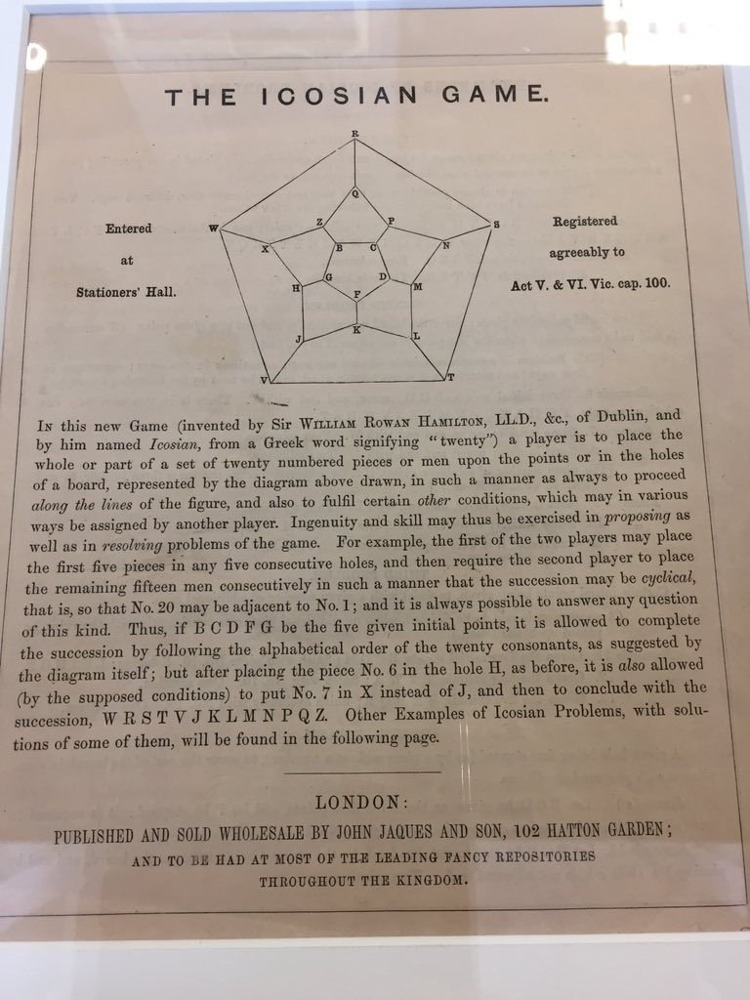
```

The Hamiltonian cycles and paths, named after the Irish mathematician William Rowan Hamilton, is a well known problem studied in computer science and graph theory. Its origin dates back to a board game called Icosian, invented by Hamilton, in which the player has the task of finding a closed path on the edge of a dodecahedron such that every vertex is visited exactly once.


```{r figIcosianBoard, fig.margin = TRUE, fig.cap = "Icosian board[Credit:Royal Irish Academy Library](https://twitter.com/Library_RIA/status/956476613096591360)", fig.height = 3, message=TRUE, cache=TRUE, echo=FALSE, fig.width=6}
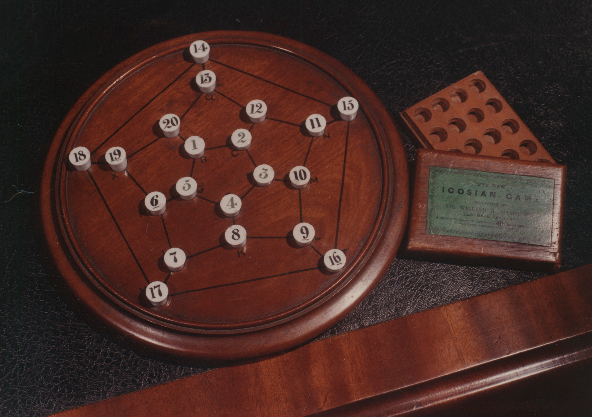
```

The Hamiltonian path between two nodes $u$ and $v$ in a general graph $G$ deals with the problem of finding a path between $(u,v)$ such that it traverses through all vertices of $G$ exactly once. 

A graph is a set of points, called vertices (or nodes), together with a collection of lines, called edges, connecting some of the vertices. A formal mathemtical definition of graph is as follows. 

(Graph): A graph is a tuple $G = (V,E)$ where $V$ is a set of vertices and $E$ is a collection of edges. The set $E$ is a collection of (usually ordered) pair of elements $e=\{ x,y\}$ where $x,y \in V$. $e=\{x,y\}$ implies that the vertices $x$ and $y$ are connected.


```{r SimpleGraphMain, fig.margin = FALSE, fig.cap = "A Graph Example. $G = (V,E)$ with $|V|=4,|E|=5$ where $V=\\{1,2,3,4\\}$ and $E=\\{\\{1,2\\},\\{2,3\\},\\{3,4\\},\\{4,1\\},\\{3,1\\}\\}$ ", fig.height = 3, message=TRUE, cache=TRUE, echo=FALSE, fig.width=4}
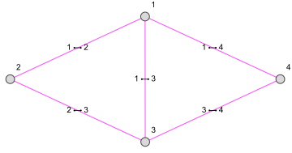
```

A Hamiltonian graph (sometimes called as Hamilton graph), is a graph which has atleast a Hamiltonian cycle. A graph that is not Hamiltonian is classified to be nonhamiltonian. A graph that contains a Hamiltonian path is called a traceable graph. 

# Grid Graphs and Rectangular Graphs
The class of graphs we are deal with here is, in some of the literature, called grid graphs.
A grid graph is a finite embedded subgraph of the infinite two-dimensional integer grid. A solid grid graph is a grid graph without holes, i.e., each bounded face of the graph is a unit square. An $m \times n$ rectangular grid graph $R(m,n)$ is a solid grid graph such that the outer boundary is an $(m − 1) \times (n − 1)$ rectangle.


That is, they're finite induced subgraphs of the infinite graph with vertices $\mathbb{Z} \times \mathbb{Z}$  with an edge from $(x,y)$ to $\left(x',y' \right)$ if, and only if, $\left \lvert x -x' \right\rvert + \left \lvert y -y' \right\rvert=1$.

```{r figGridGraph58, fig.margin = FALSE, fig.cap = "5x8 (rectangular) Grid Graph", fig.height = 4, message=TRUE, cache=TRUE, echo=FALSE, fig.width=6}
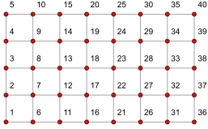
```

```{r figGridGraphGeneral, fig.margin = TRUE, fig.cap = "A General Grid Graph. For a general grid graph such as this one, finding a Hamiltonian path is computationally hard. For large sized such graphs, the problem is known to be NP-complete. ", fig.height = 3, message=TRUE, cache=TRUE, echo=FALSE, fig.width=4}
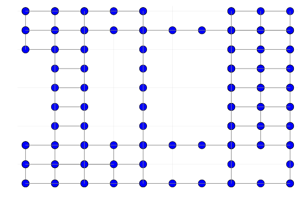
```


```{r figSolidGridGraph, fig.margin = TRUE, fig.cap = "A solid grid graph. Umans and Lenhart proved the existence of polynomial time  algorithms $O(n^{2})$ to find Hamiltonian Paths in such graphs.", fig.height = 3, message=TRUE, cache=TRUE, echo=FALSE, fig.width=4}
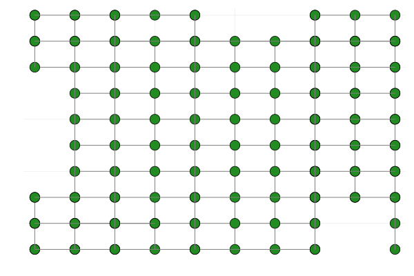
```

Hamiltonian path and cycle problems on grid graphs was studied by Luccio and Mugnia in 1978. Itai, Papadimitriou and Szwarcfiter later showed that the decision problem of finding a general grid graph is Hamiltonian or not is NP-complete. The authors also provided necessary and sufficient conditions for a rectangular grid graph to have a Hamiltonian cycle, and outlined an algorithm to find a Hamiltonian path between any two vertices in a rectangular grid graph if it exists. Chen et al. subsequentlyimproved their algorithm.

Later Umans and Lenhart came up with a polynomial time algorithm to find a Hamiltonian cycle (if it exists) in a solid grid graph using a cycle merging technique.

Now then

```{r figHamitonMatrix3_16, fig.margin = TRUE, fig.cap = "Existence of Hamiltonian paths on $R(3,16)$ graph. The light (yellow-gold) square indicates the existence of Hamiltonian path between the corresponding vertices (row index to column index). The darker color indicates that no Hamiltonian paths between those pair of vertices.", fig.height = 5, message=TRUE, cache=TRUE, echo=FALSE, fig.width=5}
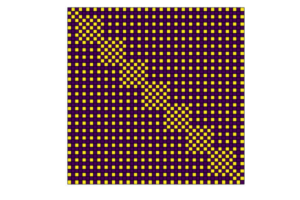
```

```{marginfigure}
We know from _the first fundamental theorem of calculus_ that for $x$ in $[a, b]$:
$$\frac{d}{dx}\left( \int_{a}^{x} f(u)\,du\right)=f(x).$$

```


## Isomorphism: Bipartite equivalence of Grid Graph 

```{r fig_grid4_hamilton_3_12-Grid, fig.width = 10, fig.height = 2, fig.fullwidth = TRUE, fig.cap = "A full width figure.", warning=FALSE, message=FALSE, cache=TRUE,echo=FALSE}
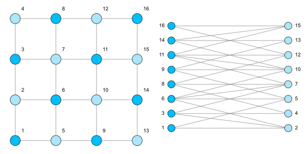
```


```{r fig_grid4_hamilton_4_4_4_14_all, fig.width = 10, fig.height = 2, fig.fullwidth = TRUE, fig.cap = "A full width figure.", warning=FALSE, message=FALSE, cache=TRUE,echo=FALSE}
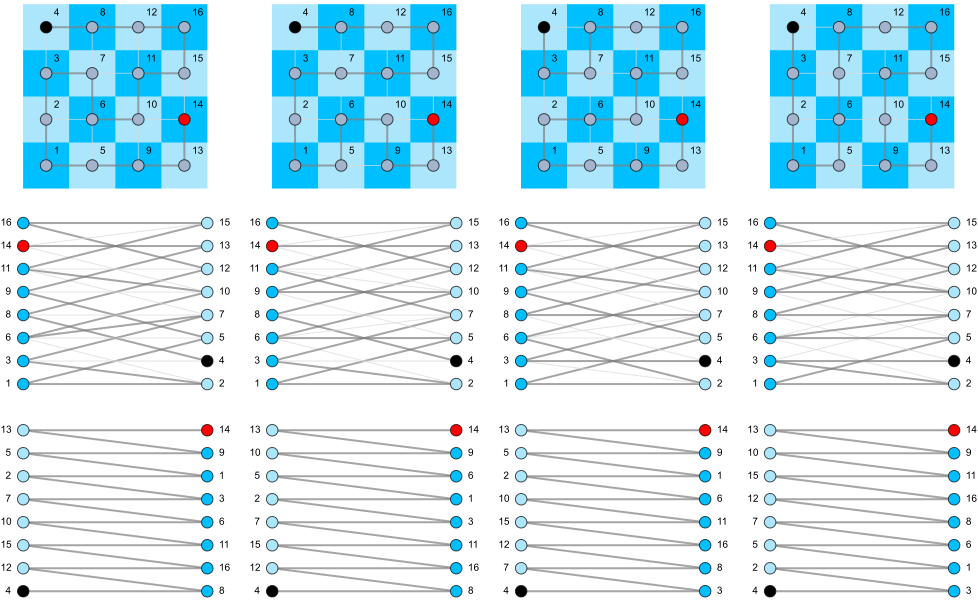
```


```{r figGridGraph10, fig.margin = TRUE, fig.cap = "10x10 (square) Grid Graph", fig.height = 5, message=TRUE, cache=TRUE, echo=FALSE, fig.width=5}
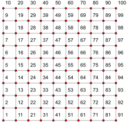
```


```{r figRect62_tree_allpaths, fig.fullwidth = TRUE, fig.cap = "R(6,2) List of possible Hamiltonian paths starting from vertex 5", fig.height = 5, message=TRUE, cache=TRUE, echo=FALSE, fig.width=5}
knitr::include_graphics("figures/fig_rect62_all.svg")
```

```{r figRect42_tree_allpaths, fig.margin = TRUE, fig.cap = "R(4,2) List of possible Hamiltonian paths starting from vertex 3", fig.height = 5, message=TRUE, cache=TRUE, echo=FALSE, fig.width=5}
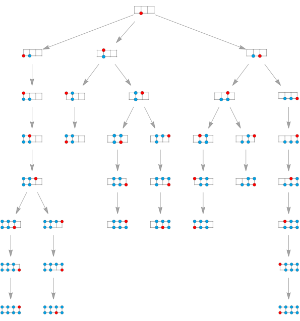
```


```{r setup, include=FALSE}
library(tufte)
# invalidate cache when the tufte version changes
knitr::opts_chunk$set(cache.extra = packageVersion('tufte'))
options(htmltools.dir.version = FALSE)
```

## Theorem lemma
Try an image


Can we see the margin figure referenced correctly as See Figure \ref(fig:figMargin1) ?

<div class="theorem" text='Itai-Papadimitrou'>
  Let $R(m, n)$ be a rectangular graph and $s$ and $t$ be two distinct vertices of it. $(R(m, n), s, t)$ is Hamiltonian if and only if $s$ and $t$ are color-compatible, and $R(m, n)$, $s$ and $t$ do not satisfy any of the following conditions $(F1)–(F3)$.
</div>


<div class="theorem" text='CLT2'>
  The CLT states that, as \(n\) goes to infinity, the sample average \(\bar{X}\)
  converges in distribution to \(\mathcal{N}(\mu,\sigma^2/n)\).
</div>


This document is also BLA.

```{r bib, include=FALSE}
# create a bib file for the R packages used in this document
knitr::write_bib(c('base', 'rmarkdown'), file = 'skeleton.bib')
```
